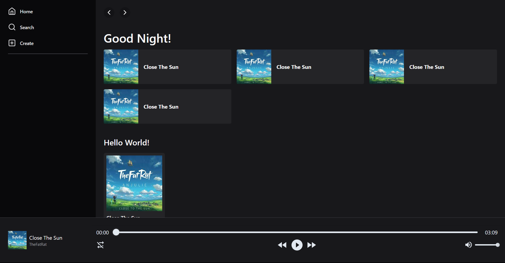

# PREVIEW

<p align='center'>
    
</p>

## Installation

1. Install Python and pip
```txt
python ver. 3.9

```

2. Clone the repository to your local machine:
```
git clone https://github.com/mgalihpp/music_player.git
```

3. Create Virtual Enviroment for Python:
```
cd/server
.venv/Scripts/activate
```

4. Install required dependecies:
```
pip install -r requirements.txt
```

5. Create a MYSQL Database:
```
CREATE DATABASE music_streaming
```

6. Run application:
```
flask --app app run