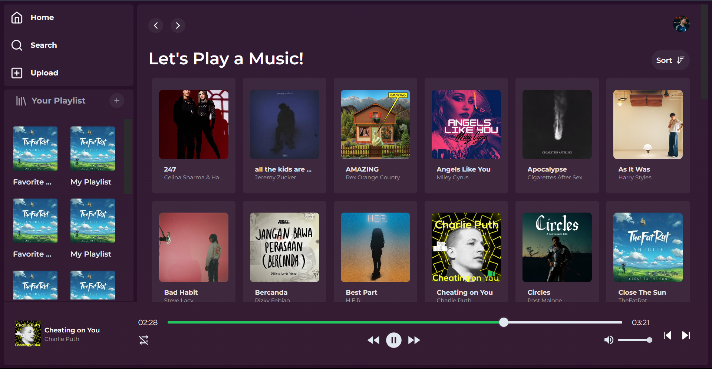

# PREVIEW

<p align='center'>
    
</p>

## Stack


## Installation

1. Install Python and node js

```txt
python ver. 3.9
node -v

```

2. Clone the repository to your local machine:

```
git clone https://github.com/mgalihpp/music_player.git
```

3. Create Virtual Enviroment for Python:

```
cd server
Python -m venv .venv
.venv\Scripts\activate
```

4. Install required dependecies:

```
pip install -r requirements.txt
```

5. Create a MYSQL Database:

```
CREATE DATABASE music_streaming

use music_streaming

CREATE TABLE musics (
  `id` int NOT NULL AUTO_INCREMENT,
  `path` varchar(1000) DEFAULT NULL,
  `name` varchar(1000) DEFAULT NULL,
  `artist` varchar(3000) DEFAULT NULL,
  `image` varchar(1000) DEFAULT NULL,
  PRIMARY KEY (`id`)
) ENGINE=InnoDB AUTO_INCREMENT=1 DEFAULT CHARSET=latin1;
```

```
CREATE TABLE playlists (
  `id` INT NOT NULL auto_increment PRIMARY KEY,
  `name` VARCHAR(255) DEFAULT NULL,
  `image` varchar(1000) DEFAULT NULL
)engine=InnoDB auto_increment=1;

CREATE TABLE music_playlist (
    id INT AUTO_INCREMENT PRIMARY KEY,
    music_id INT,
    playlist_id INT,
    FOREIGN KEY (music_id) REFERENCES musics(id),
    FOREIGN KEY (playlist_id) REFERENCES playlists(id)
);
```

6. Run application:

```
flask --app app run
```

7. Run Client Application

```
cd client
```

8. Install dependecies and Run Application:

```
npm i
npm run dev
```
